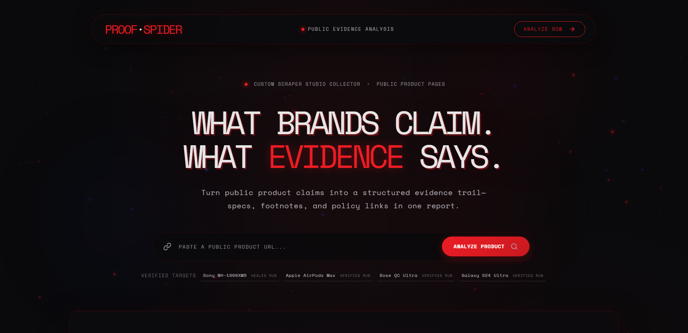
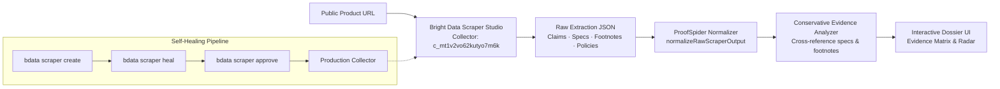

# ProofSpider 🕷️

> **The public evidence web behind what brands claim.**

ProofSpider turns public product pages into an interactive, verifiable claim evidence dossier. Powered by a **custom Bright Data Scraper Studio collector**, it cross-references marketing headlines against technical specifications, fine-print footnotes, warranty endpoints, and return policies.

Built for **Into the Scrape-Verse 2026** (WeMakeDevs × Bright Data).

---



---

## 🌐 Bright Data Scraper Studio Core

| Property | Details |
|---|---|
| **Collector ID** | [`c_mt1v2vo62kutyo7m6k`](https://brightdata.com/cp/scrapers/c_mt1v2vo62kutyo7m6k) |
| **Collector Name** | `proofspider-electronics-claims` |
| **Collector Type** | Custom Scraper Studio (AI schema with self-healing) |
| **Production Target** | Sony, Apple, Bose, Samsung & arbitrary public URLs |



---

## ⚡ Scraper Studio Lifecycle: Create ➔ Heal ➔ Verify

| Phase | Bright Data CLI Command | Committed Proof Artifact |
|---|---|---|
| **1. Create** | `npx -p @brightdata/cli bdata scraper create "..."` | [`artifacts/collector-create.json`](./artifacts/collector-create.json) |
| **2. Heal** | `npx -p @brightdata/cli bdata scraper heal c_mt1v2vo62kutyo7m6k "..."` | [`artifacts/heal.json`](./artifacts/heal.json) |
| **3. Approve** | `npx -p @brightdata/cli bdata scraper approve c_mt1v2vo62kutyo7m6k` | [`artifacts/heal-approved.json`](./artifacts/heal-approved.json) |
| **4. Verify** | `npm run scraper:verify` | [`artifacts/sony-wh1000xm5-healed.json`](./artifacts/sony-wh1000xm5-healed.json) |

### Multi-Brand Verified Datasets
- 🎧 **Sony WH-1000XM5:** [`artifacts/sony-wh1000xm5-healed.json`](./artifacts/sony-wh1000xm5-healed.json)
- 🎧 **Apple AirPods Max:** [`artifacts/apple-airpods-max-run.json`](./artifacts/apple-airpods-max-run.json)
- 🎧 **Bose QC Ultra:** [`artifacts/bose-qc-ultra-run.json`](./artifacts/bose-qc-ultra-run.json)
- 📱 **Samsung Galaxy S24 Ultra:** [`artifacts/samsung-galaxy-s24-ultra-run.json`](./artifacts/samsung-galaxy-s24-ultra-run.json)
- 📊 **Normalized Output:** [`artifacts/normalized-proofspider-result.json`](./artifacts/normalized-proofspider-result.json)

---

## ⚖️ Evidence Verdict Framework

| Verdict | Meaning | Evidence Criteria |
|---|---|---|
| 🟢 **Supported** | Corroborated | Explicitly corroborated by specs, manuals, or lab measurements. |
| 🔵 **Qualified** | Conditional | Subject to footnote asterisks, test environments, or codec limits. |
| 🟠 **Conflicted** | Contradicted | Contradicted by return policies, technical limits, or legal clauses. |
| ⚪ **Needs Evidence** | Unindexed | Marketing claim lacks public specification or footnote citation. |

---

## 🚀 Quickstart

```bash
# 1. Clone & install
git clone https://github.com/oNk2r/proof-spider.git
cd proof-spider
npm install

# 2. Run locally
npm run dev
```

Open [http://localhost:3000](http://localhost:3000).

### Optional: Live Bright Data Trigger
To trigger real-time scraping of any public URL in `.env.local`:
```env
BRIGHTDATA_API_KEY=your_brightdata_api_token
BRIGHTDATA_COLLECTOR_ID=c_mt1v2vo62kutyo7m6k
```
*(ProofSpider includes automatic self-healing fallback to extract live URLs directly if API token is omitted).*
