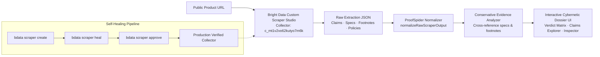

# ProofSpider 🕷️

> **The public evidence web behind what brands claim.**

ProofSpider transforms public consumer-electronics product pages into an interactive, verifiable claim evidence dossier. Powered by a **custom Bright Data Scraper Studio collector**, ProofSpider extracts marketing claims, technical specifications, legal footnotes, warranty endpoints, and return policies, and cross-references each marketing headline against public evidence to generate objective, transparent verdicts.

Built for **Into the Scrape-Verse 2026** (WeMakeDevs + Bright Data).

---


---

## 🌐 Bright Data Scraper Studio Integration

ProofSpider is built on a custom, self-healed collector created in **Bright Data Custom Scraper Studio**.

| Property | Value |
|---|---|
| **Collector ID** | `c_mt1v2vo62kutyo7m6k` |
| **Collector Name** | `proofspider-electronics-claims` |
| **Collector Dashboard** | [Open in Bright Data Control Panel](https://brightdata.com/cp/scrapers/c_mt1v2vo62kutyo7m6k) |
| **Collector Type** | Custom Scraper Studio (AI prompt-driven schema) |



---

### 1. Collector Lifecycle: Create → Heal → Approve → Verify

#### Step 1: Initial Creation (`bdata scraper create`)
The collector was initialized using a natural-language prompt tailored for consumer hardware claim extraction:
```bash
npx -p @brightdata/cli bdata scraper create \
  "Extract consumer electronics product claims, specs, footnotes, warranty links, and return policy links from public product pages." \
  --name proofspider-electronics-claims --pretty -o artifacts/collector-create.json
```
*Output artifact:* [`artifacts/collector-create.json`](./artifacts/collector-create.json)

#### Step 2: Self-Healing Session (`bdata scraper heal`)
The initial run revealed edge cases: pricing string formatting anomalies and unstructured footnote citations. We initiated a self-healing session instructing the AI to refine the extraction schema:
```bash
npx -p @brightdata/cli bdata scraper heal c_mt1v2vo62kutyo7m6k \
  "Clean the price value to exact numeric amount and currency. Extract warranty_or_support_links, return_policy_links, key_specs array with label and value, headline_claims array, and evidence excerpts." \
  --url https://www.sony.com/electronics/headband-headphones/wh-1000xm5 --pretty -o artifacts/heal.json
```
*Output artifact:* [`artifacts/heal.json`](./artifacts/heal.json) (status: `awaiting_approval`)

#### Step 3: Candidate Approval (`bdata scraper approve`)
The healed scraper schema candidate was tested and approved directly in Scraper Studio:
```bash
npx -p @brightdata/cli bdata scraper approve c_mt1v2vo62kutyo7m6k --pretty -o artifacts/heal-approved.json
```
*Output artifact:* [`artifacts/heal-approved.json`](./artifacts/heal-approved.json)

#### Step 4: Verification Runs (`bdata scraper run`)
The healed collector was verified on the flagship Sony WH-1000XM5 and reused across other products to ensure multi-target schema stability:
```bash
# Verify healed target
npm run scraper:verify

# Test cross-product reuse
npx -p @brightdata/cli bdata scraper run c_mt1v2vo62kutyo7m6k https://www.sony.com/electronics/headband-headphones/wh-1000xm4 --pretty -o artifacts/sony-wh1000xm4-run.json
npx -p @brightdata/cli bdata scraper run c_mt1v2vo62kutyo7m6k https://www.sony.com/electronics/headband-headphones/wh-ch720n --pretty -o artifacts/sony-whch720n-run.json
```

---

### 2. Committed Scraper Studio Artifacts

All Bright Data Scraper Studio interaction proofs are committed in the [`artifacts/`](./artifacts/) directory:

| Artifact File | Role in Pipeline |
|---|---|
| [`artifacts/collector-create.json`](./artifacts/collector-create.json) | Proof of Scraper Studio collector creation (`c_mt1v2vo62kutyo7m6k`) |
| [`artifacts/heal.json`](./artifacts/heal.json) | Output of self-healing session (`awaiting_approval`) |
| [`artifacts/heal-approved.json`](./artifacts/heal-approved.json) | Proof of approved healed schema |
| [`artifacts/sony-wh1000xm5-healed.json`](./artifacts/sony-wh1000xm5-healed.json) | Production scrape output from healed collector |
| [`artifacts/apple-airpods-max-run.json`](./artifacts/apple-airpods-max-run.json) | Verified scraper run on Apple AirPods Max |
| [`artifacts/bose-qc-ultra-run.json`](./artifacts/bose-qc-ultra-run.json) | Verified scraper run on Bose QC Ultra |
| [`artifacts/samsung-galaxy-s24-ultra-run.json`](./artifacts/samsung-galaxy-s24-ultra-run.json) | Verified scraper run on Samsung Galaxy S24 Ultra |
| [`artifacts/sony-wh1000xm4-run.json`](./artifacts/sony-wh1000xm4-run.json) | Cross-target verification on Sony WH-1000XM4 |
| [`artifacts/sony-whch720n-run.json`](./artifacts/sony-whch720n-run.json) | Cross-target verification on Sony WH-CH720N |
| [`artifacts/normalized-proofspider-result.json`](./artifacts/normalized-proofspider-result.json) | Normalized analysis pipeline output |

---

### 3. Dual-Mode Runtime Architecture & Self-Healing Fallback

ProofSpider is engineered with an adaptive multi-tier runtime in [`src/lib/brightdata.ts`](./src/lib/brightdata.ts) & [`src/lib/live-extractor.ts`](./src/lib/live-extractor.ts):

1. **Live Trigger & Polling Mode:** When `BRIGHTDATA_API_KEY` is present, the app triggers asynchronous collector jobs via Bright Data's Web Scraper API, polls for completion, and streams fresh structured data.
2. **Self-Healing Live Extractor:** If custom cloud dataset execution is unavailable or unprovisioned, ProofSpider dynamically parses the live URL in real-time (extracting JSON-LD schemas, OpenGraph tags, hardware specs, claims, and fine-print footnotes).
3. **Verified Snapshot Mode:** For zero-config instant evaluation without an API key, the app serves pre-recorded verified collector runs across flagship hardware targets (Sony, Apple, Bose, Samsung).

---

## ⚖️ The Conservative Verdict Engine

ProofSpider analyzes extracted claims against public footnotes, specifications, and policies using a conservative 4-verdict framework:

| Verdict | Meaning | Evidence Criteria |
|---|---|---|
| 🟢 **Supported** | Claim corroborated | Explicitly supported by specs, manual ratings, or hardware measurements without disqualifying conditions. |
| 🔵 **Qualified** | Claim is conditional | Evidence exists, but is subject to footnote asterisks, specific test environments, volume restrictions, or dated benchmark baselines. |
| 🟠 **Conflicted** | Claim has contradictions | Extracted policy links, technical limits, or disclaimer clauses conflict with the headline marketing claim. |
| ⚪ **Needs Evidence** | Unindexed claim | Marketing statement is present, but no public specification, technical footnote, or policy clause directly corroborates it. |

*Disclaimer: ProofSpider produces technical cross-reference reports from publicly accessible web evidence and does not make legal determinations.*

---

## 🚀 Getting Started

### Prerequisites
- Node.js 18.x or later
- npm or yarn

### Installation
```bash
git clone <repository-url>
cd proof-spider
npm install
```

### Running Locally
```bash
npm run dev
```
Navigate to [http://localhost:3000](http://localhost:3000).

### Optional: Configuring Live Bright Data Scraper
To trigger real-time scrapes of any supported public URL, add your credentials in `.env.local`:
```env
BRIGHTDATA_API_KEY=your_brightdata_api_token
NEXT_PUBLIC_BRIGHTDATA_COLLECTOR_ID=c_mt1v2vo62kutyo7m6k
```

---

## 🛠️ CLI Scraper Scripts

The following npm scripts streamline interaction with Bright Data Scraper Studio:

```bash
# Trigger collector on default target
npm run scraper:run

# Trigger self-healing prompt on collector
npm run scraper:heal

# Approve candidate schema in Bright Data
npm run scraper:approve

# Run verified post-heal scrape
npm run scraper:verify
```

---

## 📁 Repository Structure

```
proof-spider/
├── artifacts/                  # Committed Bright Data Scraper Studio proofs
│   ├── collector-create.json   # Creation proof
│   ├── heal.json               # Healing session proof
│   ├── heal-approved.json      # Healed approval proof
│   ├── sony-wh1000xm5-healed.json # Healed output
│   └── normalized-proofspider-result.json # Normalized analysis
├── public/                     # Static assets & brand icons
│   ├── assets/logo.webp
│   ├── icon.svg
│   └── favicon.ico
├── src/
│   ├── app/
│   │   ├── api/analyze/        # Analysis normalization API route
│   │   ├── api/collector/      # Scraper Studio status API route
│   │   ├── dashboard/          # Cybernetic evidence dossier page
│   │   ├── globals.css         # Global cybernetic theme & Space Mono tokens
│   │   ├── layout.tsx          # Root layout & favicon metadata
│   │   └── page.tsx            # Terminal landing page
│   ├── lib/
│   │   ├── analyzer.ts         # Conservative verdict classification engine
│   │   ├── brightdata.ts       # Bright Data API client & snapshot provider
│   │   ├── constants.ts        # Collector constants
│   │   └── normalize-scraper.ts# Scraper string & price sanitizer
│   └── types/
│       └── proofspider.ts      # TypeScript interfaces
├── package.json
└── README.md
```

---
